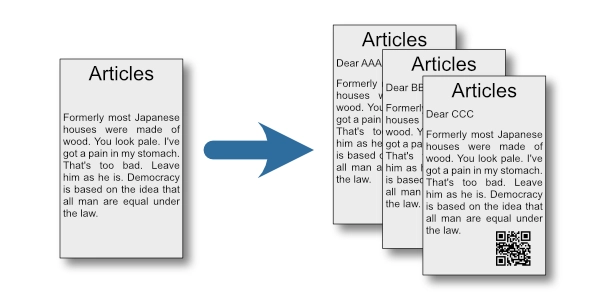

# QR Code Print



A cross-platform Rust application that generates PDFs with QR codes and text based on CSV data and placement specifications.

## Features

- Works on macOS, Windows, and Linux
- Reads CSV data from `data.csv`
- Reads placement configuration from `settings.json`
- Uses `base.pdf` as a template
- Generates QR codes or places text at specified positions
- Unit-based dimensions (mm, cm, in, pt)
- CJK font support with automatic CID font detection
- Command-line interface for directory targeting
- Outputs to `output.pdf` (one page per CSV row)

## Dependencies

- **serde** & **serde_json**: JSON parsing
- **csv**: CSV file reading
- **qrcode**: QR code generation
- **image**: Image processing (PNG encoding)
- **lopdf**: PDF manipulation
- **anyhow**: Error handling
- **flate2**: Data compression for PDF images
- **fontdb**: System font discovery
- **ttf-parser**: TrueType font parsing
- **clap**: Command-line argument parsing

## File Format

### settings.json

```json
{
  "fields": {
    "URL": {
      "x": "100 mm",
      "y": "100 mm",
      "w": "50 mm",
      "h": "50 mm",
      "type": "QR"
    },
    "ID": {
      "x": "150 mm",
      "y": "50 mm",
      "w": "100 mm",
      "h": "30 mm",
      "type": "Text"
    },
    "Name": {
      "x": "50 mm",
      "y": "200 mm",
      "w": "50 mm",
      "h": "10 mm",
      "type": "Text"
    }
  },
  "settings": {
    "font": "Meiryo UI"
  }
}
```

**Fields:**
- `fields`: Object mapping CSV column names to placement specifications
  - `x, y`: Position from top-left corner (supports units: `"100 mm"`, `"10 cm"`, `"1 in"`, `"100 pt"`, or raw numbers as points)
  - `w, h`: Width and height (same unit support as x/y)
  - `type`: Either `"QR"` for QR codes or `"Text"` for text rendering
- `settings`: Optional settings
  - `font`: Font name for text rendering (supports standard PDF fonts and auto-detects CJK fonts)

### data.csv

```csv
URL,ID,Name
https://example.com/item001,A001,Item One
https://example.com/item002,B002,Item Two
```

## Non-ASCII Character Support

The application supports non-ASCII characters (e.g., Japanese, Chinese, Korean, Cyrillic, etc.) through automatic CID font detection. When non-ASCII characters are detected in your data, the application will:

1. Search for a suitable CJK font installed on your system
2. Automatically embed the font in the output PDF
3. Encode text using UTF-16BE format for proper rendering

### Font Installation

If you encounter an error about missing CID fonts when using non-ASCII characters, install a CJK font package:

**Debian/Ubuntu:**
```bash
sudo apt-get install fonts-noto-cjk
```

**Arch Linux:**
```bash
sudo pacman -S noto-fonts-cjk
```

**macOS:**
CJK fonts are typically pre-installed (Hiragino, Yu Gothic, etc.)

**Windows:**
CJK fonts are typically pre-installed (MS Gothic, MS Mincho, Meiryo, etc.)

The application will automatically detect and use available fonts such as:
- Noto Sans CJK (all platforms)
- Hiragino Sans/Gothic (macOS)
- MS Gothic/Mincho, Meiryo (Windows)
- IPA Gothic/Mincho (Linux)

## Building

```bash
cargo build --release
```

## Running

```bash
cargo run
```

This will use the current directory. To specify a different directory containing `base.pdf`, `settings.json`, and `data.csv`:

```bash
cargo run -- --target-dir /path/to/directory
```

### Command-Line Options

- `-t, --target-dir <DIR>`: Target directory containing input files (default: current directory)

## Creating a base PDF

A sample base PDF can be created using the provided example:

```bash
cargo run --example create_base_pdf
```

## Coordinates and Units

Dimensions can be specified using:
- **Points (pt)**: `"100 pt"` or `"100 points"` or just `100` (default unit)
- **Millimeters**: `"100 mm"`
- **Centimeters**: `"10 cm"`
- **Inches**: `"1 in"` or `"1 inch"` or `"1 inches"`

All dimensions are converted internally to PDF points (1 inch = 72 points).

## API Documentation

### Configuration Module (`config`)

#### `Dimension`

A dimension value that can be specified as a number or a string with units.

```rust
use qr_code_print::config::Dimension;

// From number (interpreted as points)
let dim = Dimension(100.0);

// From string with unit (deserialized from JSON)
// Supports: "100 mm", "10 cm", "1 in", "100 pt"
let points = dim.as_points();
```

#### `FieldSpec`

Placement specification for a field in the PDF.

**Fields:**
- `x: Dimension` - X position from top-left corner
- `y: Dimension` - Y position from top-left corner
- `w: Dimension` - Width
- `h: Dimension` - Height
- `output_type: String` - Either "QR" or "Text"

#### `PlaceConfig`

Complete configuration from settings.json.

**Fields:**
- `fields: HashMap<String, FieldSpec>` - Field placement specifications
- `settings: SettingsSection` - Optional settings (font configuration)

#### `DataRow`

A single row of CSV data.

**Fields:**
- `data: HashMap<String, String>` - Column name to value mapping

#### Functions

##### `load_settings_config(path: &Path) -> Result<PlaceConfig>`

Load and parse settings.json.

##### `load_csv_data(path: &Path) -> Result<Vec<DataRow>>`

Load and parse data.csv.

##### `load_base_pdf(path: &Path) -> Result<Vec<u8>>`

Load base.pdf as raw bytes.

### PDF Module (`pdf`)

#### Font Module (`pdf::fonts`)

##### `StandardFont`

Standard PDF Type1 fonts.

**Variants:**
- `Helvetica`, `HelveticaBold`, `HelveticaOblique`, `HelveticaBoldOblique`
- `TimesRoman`, `TimesBold`, `TimesItalic`, `TimesBoldItalic`
- `Courier`, `CourierBold`, `CourierOblique`, `CourierBoldOblique`

```rust
use qr_code_print::pdf::fonts::StandardFont;

let font = StandardFont::from_name("helvetica-bold").unwrap();
let base_font = font.base_font_name(); // "Helvetica-Bold"
```

##### Functions

###### `create_font(doc: &mut Document, font: StandardFont) -> Result<((u32, u16), String)>`

Create a standard PDF Type1 font. Returns the font object ID and base font name.

###### `embed_cid_font(doc: &mut Document, font_data: &[u8], font_name: &str) -> Result<((u32, u16), String)>`

Embed a CID-keyed font for CJK characters. Creates a Type0 font with a CIDFont descendant for proper CJK rendering.

###### `find_cid_font() -> Option<(Vec<u8>, String)>`

Find a CJK-capable font in the system. Automatically searches for common Japanese fonts (Hiragino, Noto, IPA, Yu, Meiryo, MS).

#### Document Module (`pdf::document`)

##### `create_output_pdf(base_doc: &Document, data_rows: &[DataRow], config: &PlaceConfig) -> Result<Document>`

Create the output PDF by processing all data rows and generating pages with QR codes and text placed according to the configuration.
